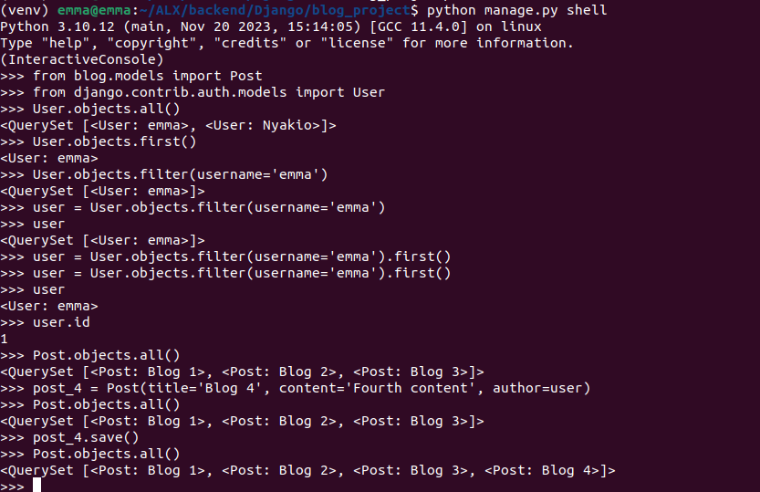

Create a Django app
Version of Django : python -m django --version
createing a project : django-admin startproject blog_project
run app: python manage.py runserver
Create blog app within blog_project app : python manage.py startapp blog, python manage.py startapp users

Create a super user in django
python manage.py makemigrations
python manage.py migrate
python manage.py createsuperuser

Create sql table
(venv) emma@emma:~/ALX/backend/Django/blog_project$ python manage.py makemigrations
    Migrations for 'blog':
    blog/migrations/0001_initial.py
        - Create model Post
(venv) emma@emma:~/ALX/backend/Django/blog_project$ python manage.py sqlmigrate blog 0001

Query Data set

****************************************************
Deploy to Heroku
- pip install gunicorn django-heroku
- Create runtime.txt, Procfile, pip freeze > requirements.txt
- Settings.py add : import django_heroku
                    import dj_database_url

                    STATIC_ROOT = os.path.join(BASE_DIR, 'staticfiles')
                    STATICFILES_DIRS = (os.path.join(BASE_DIR, 'static'),)
                    django_heroku.settings(locals())

                    ALLOWED_HOSTS = ['*']

- heroku login
- heroku create exploreke